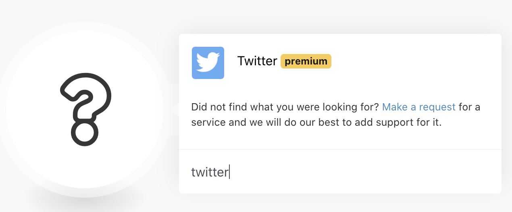

# Splunk OSINT Collection
Supporting detail for the Splunk ANZ User Group talk "What the HEC??!? Automating collection of threat intelligence with Splunk HEC", from 9th December 2020. 

Process for setting up ingestion of a Twitter list to Splunk Cloud.

## Pre Requisites
- A Twitter account. https://twitter.com/
- An Integromat account. https://www.integromat.com/
- A Splunk Cloud instance. https://www.splunk.com/page/sign_up/cloud_trial

Note, you could use Splunk Enterprise, instead of Cloud, with some minor tweaks to the process, but you will need to get the HEC endpoint exposed (safely, securely!) to the Internets.

## Twitter Setup
1. Login to Twitter.
2. Create a list with all the goodies you want to watch. 
https://help.twitter.com/en/using-twitter/twitter-lists

## Splunk Setup
1. Login to Splunk (not your IDM, but the Search Head instance!)
2. Select ***Settings > Indexes***.
3. Click the ***New Index*** button.
4. Enter a name for your new index, leave the index type as ***Events***, and enter your preferred values for ***Max raw data size*** and ***Searchable time***. I went with 0GB (unlimited) and a 90 day rentention.
5. Click ***Save*** to create your new index.
6. Click ***Settings > Data inputs***
7. Under HTTP Event Collector, select the ***Add new*** option.
8. Enter a name for your HEC input, and optionally a description.
9. Click Next.
10. Under ***Source type***, select ***Structured > _json***.
11. Select the ***App context*** you want your input to live.
12. Under ***Index***, select your new index under the ***Select Allowed indexes*** and also set the default index to this value.
13. Click the ***Review*** button.
14. Make sure the details are correct, and then click the ***Submit*** to create your HEC input.
15. You will be provided a token value, used in the next step.

## Integromat Setup
1. Login to Integromat.
2. Click on ***Scenarios***.
3. Click the ***Create a new scenario*** button. Skip the wizard.
4. In the new scenario, right click anywhere on the canvas, and select ***Add a module***.


5. Select ***Twitter***.



6. Select ***Watch Tweets in List***.


7. Click on the Twitter module to access it's settings.


8. Click ***Add*** under Connection. Do the OAuth dance to autorise Integomat to connect to Twitter as you.
9. Select *Search List* ***By ID*** and your watch list under *List ID*.
10. Optionally, personalise the other settings to your needs.
11. Add another module by right clicking on the canvas, this time adding a ***HTTP*** module.
12. Configure the HTTP module according to the details in [twitter-integromat.txt](twitter-integromat.txt)
13. Click on the clock icon in the lower left corner of the scenario, to configure the schedule.


14. Set the flow to run ***At regular intervals***, for whatever time period you prefer. Click ***OK*** when done.
15. Enable the schedule.


16. Save the scenario by clicking on the floppy disk icon. If you are a millenial and don't know what a floppy disk is, it's the leftmost icon under *Controls*. 


## Testing and Troubleshooting
1. If you don't see anything , click the ***Run once*** button. Check for any errors, and ensure that your Twitter list has produced at least one updated tweet. If not, add some noisy Twitter accounts for testing purposes.
2. If no errors seen in Integromate, login to Splunk, query the index you configured for your HEC input.

```index=prod_osint```

3. If you don't see any data, check your token values, and inspect the `_internal` index for errors.

```index=_internal```
